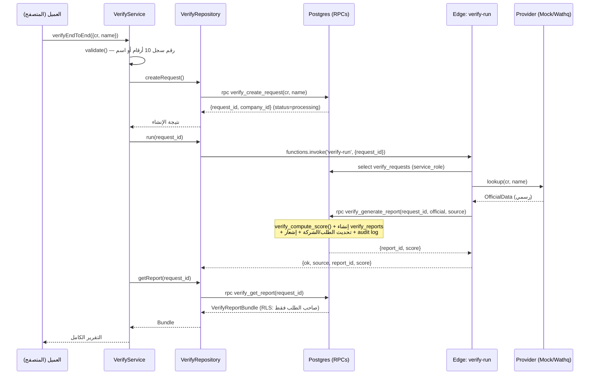

# أمرني · Verify — Trust Infrastructure (Phase 1)
## توثيق العمارة (System Architecture)

> النطاق: هذا المستند يغطي **Phase 1: Verify Foundation** فقط — تحقق العميل من مورد
> عبر رقم السجل التجاري/الاسم، بتقرير ثقة (Trust Report). بُني بالكامل على بيئة
> **staging** (`cffgpffgpmxtyjybbxsf`). لا شيء منه لُمس على الإنتاج.

---

## 1) الفكرة المعمارية

Verify ليست خدمة تحقق منفصلة — هي **طبقة الثقة (Trust Layer)** التي تُبنى عليها
لاحقاً منظومة RFQ والشراء والذكاء الاصطناعي. لذلك صُمّمت بثلاثة مبادئ صارمة:

1. **فصل الطبقة الرسمية عن التشغيلية.** بيانات السجل التجاري (من واثق) لا يكتبها
   العميل أبداً — تُكتب حصراً بصلاحية `service_role` عبر RPC واحدة
   (`verify_generate_report`). هذا يمنع تزوير الثقة بشكل بنيوي، لا عبر تحقق تطبيقي فقط.
2. **مصدر حقيقة واحد لحساب الثقة.** محرك `verify_compute_score` دالة SQL واحدة —
   لا يُعاد حساب النتيجة في الواجهة أو أكثر من مكان.
3. **Concierge-First.** الطبقة التشغيلية (مشاريع سابقة، مواقع، شهادات) قابلة للتعبئة
   اليدوية من الأدمن عبر `verify_evidence`، ثم تُؤتمت تدريجياً.

## 2) الطبقات (Clean Architecture)

```
┌─────────────────────────────────────────────────────────────┐
│  UI Layer            src/pages/VerifyPage.tsx                │
│                       src/pages/VerifyReportPage.tsx          │
├─────────────────────────────────────────────────────────────┤
│  Facade (barrel)     src/lib/verify/index.ts                  │
│                       createVerifyRequest / runVerification /  │
│                       getVerifyReport / listMyVerifyRequests /  │
│                       verifyEndToEnd                            │
├─────────────────────────────────────────────────────────────┤
│  Service Layer       src/lib/verify/service.ts                 │
│                       VerifyService — تحقق fail-fast + تنسيق   │
│                       حالات الاستخدام (لا تفاصيل Supabase هنا) │
├─────────────────────────────────────────────────────────────┤
│  Repository Layer    src/lib/verify/repository.ts              │
│                       VerifyRepository — الوصول الوحيد لـ RPC/  │
│                       Edge، عبر تجريد SupabaseLike (قابل للحقن) │
├─────────────────────────────────────────────────────────────┤
│  Models              src/lib/verify/models.ts                  │
│                       أنواع النطاق + بيانات العرض (VERDICT_META)│
├─────────────────────────────────────────────────────────────┤
│  Composition Root    src/lib/verify/client.ts                  │
│                       يربط الطبقات النقية بعميل Supabase الحقيقي│
├─────────────────────────────────────────────────────────────┤
│  Integration Layer   src/lib/verify/providers.ts                │
│  (Adapter)            (نفس الملف منسوخ حرفياً في                │
│                       supabase/functions/verify-run/providers.ts│
│                       — اختبار تزامن يمنع الانحراف)             │
│                       MockProvider ⇄ WathqProvider خلف          │
│                       واجهة OfficialProvider واحدة               │
├─────────────────────────────────────────────────────────────┤
│  Edge Function       supabase/functions/verify-run/index.ts     │
│                       الخادم الموثوق: يجلب الطبقة الرسمية        │
│                       ويكتبها بصلاحية service_role                │
├─────────────────────────────────────────────────────────────┤
│  Database Layer      supabase/migrations/035_verify_...sql      │
│                       6 جداول + 6 RPCs + RLS + Trust Score Engine│
└─────────────────────────────────────────────────────────────┘
```

**لماذا هذا الفصل تحديداً؟**
- طبقة الخدمة (`VerifyService`) لا تعرف شيئاً عن Supabase — يمكن استبدال المستودع
  بالكامل (مثلاً REST بديل) دون لمس منطق التحقق من المدخلات أو تنسيق `verifyEndToEnd`.
- طبقة المستودع (`VerifyRepository`) تعتمد على واجهة `SupabaseLike` وليس عميل
  Supabase الفعلي — هذا ما يسمح باختبارات تكامل بعميل وهمي دون شبكة حقيقية.
- ملف `client.ts` هو "Composition Root" الوحيد الذي يربط الطبقات النقية بالتنفيذ
  الحقيقي، فباقي الملفات تبقى قابلة للاستيراد في بيئة اختبار Node بلا متغيرات بيئة.

## 3) تدفّق التحقق الكامل (Sequence)



## 4) الأمان البنيوي (لماذا لا يمكن تزوير الثقة)

- `verify_generate_report` **مُلغاة الصلاحية** عن `authenticated`/`anon`، ومُمنوحة
  حصراً لـ `service_role`. العميل لا يستطيع مطلقاً كتابة الطبقة الرسمية حتى لو
  استدعى الدالة مباشرة من المتصفح.
- كل جداول Verify عليها RLS مفعّل. لا سياسة عامة "select using (true)" على جدول
  يحوي بيانات حسّاسة — القراءة مقيّدة بالملكية (`requester_id = auth.uid()`) أو
  بدور الأدمن (`verify_is_admin()` — دالة SECURITY DEFINER تفحص `profiles.role`).
- الإدخال المباشر على `verify_companies` من العميل **ممنوع بنيوياً**: السياسة الوحيدة
  للكتابة هي `verify_companies_admin_write`، فلا "self-registration" لمورد.

## 5) طبقة التكامل (Adapter) — Wathq

- **العقد الموحّد**: `OfficialProvider.lookup(cr, name) → OfficialData`. أي مصدر
  بيانات مستقبلي (مثلاً مزوّد بديل) يلتزم بنفس الواجهة دون تغيير أي كود آخر.
- **MockProvider**: بيانات حتمية (deterministic) مبنية على بذرة (seed) مشتقة من
  رقم السجل/الاسم — نفس المدخل ينتج دائماً نفس المخرج، وهذا ما يجعله قابلاً للاختبار.
- **WathqProvider**: يُفعَّل تلقائياً عند وجود السر `WATHQ_API_KEY` (ما لم يُفرض
  `WATHQ_MOCK=true`). لا مفاتيح مكتوبة في الكود — فقط `Deno.env.get(...)` من
  Environment Secrets الخاصة بالـEdge Function.
- **`getProvider(env)`**: مصنع الاختيار، مُختبر بكل الحالات الثلاث (بلا مفتاح / مع
  مفتاح / فرض Mock رغم وجود المفتاح).

## 6) البيئات

| البيئة | المعرّف | الحالة |
|---|---|---|
| Production (Amrni) | `urgqapqkbwhornmgqaav` | **لم يُلمس إطلاقاً** في هذه المرحلة |
| Staging (amerni-staging) | `cffgpffgpmxtyjybbxsf` | مخطط Verify + قاعدة أساسية مطبّقة، مُختبرة بالكامل |

القاعدة الأساسية على staging (`profiles`, `notifications`) بُنيت كمرآة أمينة
لأعمدة الإنتاج (بدون ربط `auth.users` — إجراء خاص بالاختبار فقط، موثّق في قسم
"المخاطر" بتقرير التسليم النهائي).
