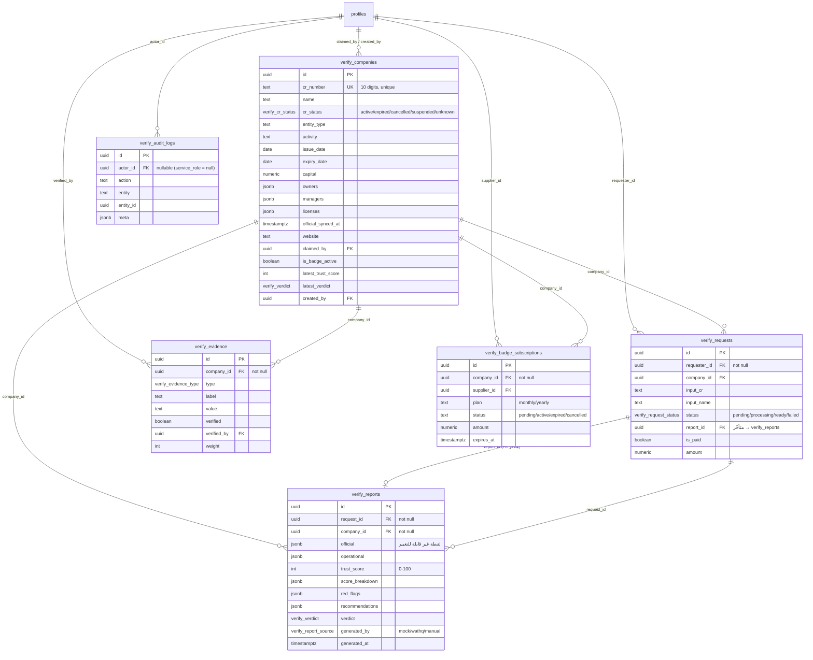

# أمرني · Verify — مخطط العلاقات (ERD)

## المخطط

## ملاحظات على العلاقات

- **`verify_requests.report_id` → `verify_reports.id`**: قيد FK يُضاف بعد إنشاء
  الجدولين (`do $$ ... exception when duplicate_object ...`) لأن `verify_reports`
  يعتمد أصلاً على `verify_requests.id` — علاقة دائرية مقصودة تُحل بترتيب الإنشاء
  ثم إضافة القيد المتأخر.
- **`verify_reports` غير قابل للتعديل (immutable) منطقياً**: لا توجد أي سياسة RLS
  أو RPC تسمح بـ`UPDATE` على هذا الجدول بعد الإدخال — كل تقرير هو لقطة (snapshot)
  ثابتة في تلك اللحظة، حتى لو تغيّرت بيانات الشركة لاحقاً.
- **`verify_companies.cr_number` فريد (UNIQUE) عند وجوده**: يمنع تكرار نفس السجل
  التجاري كصفين مختلفين — أي طلب تحقق لاحق لنفس السجل يُعاد استخدام نفس الصف
  ويُراكم عليه (بدلاً من تكرار الشركة).
- **الفهارس (22 إجمالاً)**: على كل مفتاح خارجي، وعلى `cr_number`/`name` للبحث،
  وفهرس جزئي (`partial index`) على `is_badge_active` (`where is_badge_active`)
  لتسريع استعلامات "الموردون الموثّقون فقط" دون فحص كامل الجدول.

## الأنواع المعدودة (Enums)

| Enum | القيم |
|---|---|
| `verify_request_status` | `pending`, `processing`, `ready`, `failed` |
| `verify_verdict` | `recommended`, `caution`, `not_recommended` |
| `verify_cr_status` | `active`, `expired`, `cancelled`, `suspended`, `unknown` |
| `verify_evidence_type` | `website`, `social`, `project`, `customer`, `certificate`, `accreditation`, `image`, `video`, `catalog`, `response_speed`, `review` |
| `verify_report_source` | `mock`, `wathq`, `manual` |
